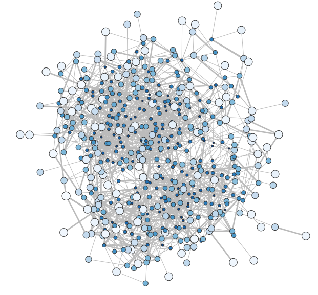

# noisy-networks-measurements

Bayesian reconstruction of networks from noisy measurements, with examples.
The theory explaining these models is presented in ["Bayesian inference of network structure from unreliable data"](https://academic.oup.com/comnet/article/8/6/cnaa046/6161493), by [J.-G. Young](http://jgyoung.ca), [G. T. Cantwell](https://www.george-cantwell.com/) and [M.E.J. Newman](http://www-personal.umich.edu/~mejn/).
Here we provide several examples of models coded in `Stan`, as well as [a tutorial](tutorial/tutorial.ipynb) reproducing one of the case studies of the paper.





## Models

The Stan models work with any [Stan interface](https://mc-stan.org/users/interfaces/) (Python, R, Julia, etc.).

* [Examples](examples/): Standard models for Bernoulli/Poisson measurements with ER or SCM network priors.
* [Templates](templates/): Extensible templates for custom models without writing boilerplate code.

## Python setup

Python is our preferred way to interact with `Stan`.
To follow our exact approach, install dependencies as follows.
```bash
uv sync                    # or: pip install cmdstanpy numpy
uv sync --extra tutorial   # includes matplotlib, networkx, pandas, seaborn, jupyter
uv run python -m cmdstanpy.install_cmdstan  # install the Stan compiler (one-time setup, may take a few minutes)
```
You're then ready to follow the [tutorial](tutorial/tutorial.ipynb).

## Paper

If you use this code, please consider citing:

"[*Bayesian inference of network structure from unreliable data*](https://academic.oup.com/comnet/article/8/6/cnaa046/6161493)"<br/>
[J.-G. Young](http://jgyoung.ca), [G. T. Cantwell](https://www.george-cantwell.com/) and [M.E.J. Newman](http://www-personal.umich.edu/~mejn/)<br/>
J. Complex Netw. **8**, cnaa046 (2021) <br/>

## Author

Code by [Jean-Gabriel Young](https://www.jgyoung.ca). Don't hesitate to get in touch at <jean-gabriel.young@uvm.edu>, or via the [issues](https://github.com/jg-you/noisy-networks-measurements/issues)!
